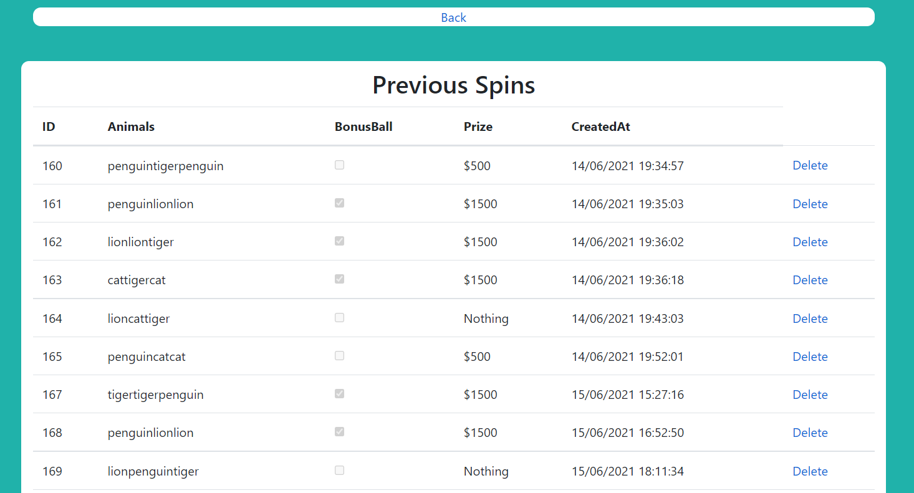

# SlotMachineApplication
A project which combines all aspects of fundamental training in QA.

This project will involve concepts from all core training modules; more
specifically, this will involve:

* Project Management
* C# Fundamentals
* Unit Testing
* Git
* Continuous Integration
* Software Development with C#
* Cloud Fundamentals
* Databases

## The Idea ##
The application is based on a traditional slot machine with an additional twist; a bonus number. The user will get a random combination of animals on a spin, there are prizes rewarded depending on the combination. The application will simulate a spin on the slot machine and the application idea incorporates multiple services working together to generate a 'random' prize for the user. 

## Requirements ##
The conception of this project involved setting up a clear structure of requirements. I undertook MoSCoW prioritization techniques to get started; this a common requirements management strategy for agile based development projects. I looked at project requirements under 4 scopes: **Must Have, Should Have, Could Have and Won't Have;** listed in descending order of priority.

#### MoSCoW Requirements Diagram ####

In the four quadrants above, each represents one the prioritization categories, the **Must Have** section is the most important because it represents requirements which must be met in order to obtain a minimum viable product. The next step is representing the project requirements in a more development-digestible format using a **Kanban board**; the requirements will be broken down through **Stories and Epics**

## Analysis ##
The next phase of the project requires stringent risk analysis to decide on protocols in typical scenarios that may arise during the development life cycle. I created a **Risk Assessment Matrix** to represent and evaluate risks involved in the project going forward. These risks are assessed under the following headings: **Evaluation, Likelihood, Impact, Responsibility, Response and Control Measure.**

### Risk Assessment ###
These risks were formulated based on the technology stack required for the project and analyzing what could go wrong in their interactions, there is a clear pattern of how these risks arise and what the approach to them will be.

#### Risk Assessment Matrix ####
|   Risk          | Evaluation | Likelihood| Impact  | Responsibility   |Response   | Control Measure  |
|:-------|:------|:---    |:---    |:-------|:------|:-----  |
| Application's virtual machine goes down | Application goes offline| Low | High | Cloud Service Provider  | Recreate infrastructure on another machine |  Use terraform scripts to rapidly recreate infrastructure  |
| Broken version deployed onto production   | Application may not have all required features functional  |   Medium    | High | Developer     | Revert production to latest stable version  | Automate tests before production push and restrict access to production branch      |
| DDOS attack    | Server goes down |    Medium    | High | Microsoft | Use terraform scripts to recreate infrastructure on another machine  |  Use terraform scripts to quickly recreate machine   |
| High traffic    | Server requests could be unreliable/unavailable   |  Medium  | High| Developer  | Buy more azure server network allocation  | Ensure services are elastic|
| Data breach    | Customer data compromised   |   Medium    | Medium | Developer  | Notify relevant parties | Revise project access hierarchy and advise on latest security practices|
| Regional power outage     | Application goes offline   |    Low    | High | Cloud Service Provider  | Recreate infrastructure in another region  | Set up standby server in another region |
| Not delivering requirements on schedule    | Application wont meet minimum viable product scope  |    Medium    | High | Developer  | Amend scheduled project delivery time   | Stick to minimum viable product scope as a first priority |

### User Stories ###

Using Jira, the project requirements were tracked continuously using a kanban board which can be seen [here](https://darrendoyle.atlassian.net/jira/software/projects/SMA/boards/4 "Named link title"). The project tracking process was very simple and revolved around user stories which could either be frontend or related to the other micro services. A user story will usually outline a job that needs to be done from a developer or user perspective. I put all user stories on the backlog and when it was time to use them, I would put them on the kanban board. The kanban board has four simple stages: To Do, In Progress, Testing, Done. To Do means the story is yet to be taken up or worked on yet, this may be because of dependency on another user story. In Progress means the story is being worked on currently. Testing means the completed story is being analysed for any bugs, if it passes it moves to Done.

## Design ##
### Technologies Used ###
* Kanban Board: Jira
* Programming languages: C#
* Version Control: Git
* CI Server: Github Actions
* Database: MySQL
* Cloud Platform: Azure
* Infrastructure as Code: Terraform

This diagram give a general understanding of the development process for the application. The frontend service provides a visual platform for the other 3 services to work within. The project is sourced controlled with git, stored on github and continuously delivered/integrated with Azure Pipelines. The infrastructure to run this architecture is spun up using terraform scripting, configuration is managed through Ansible.

## Project Structure ##

## Service 1 - Frontend ##

The frontend service provides a UI with which to work with the other services within the application. It is a Model View Controller(MVC) desgined service which displays html in web browser, the main page displays a users slot machine results and options to spin again or save spins. The home controller parses results from the merge service which are passed in json format. These results are displayed using viewbag variables. 

### Database ###

There is a MySQL database hosted in an Azure server which attaches to the frontend service. The database has one table for storing user 'Spins', this allows users to save their best spins and see prizes won over time. The frontend controller has actionresults which display all records in the spin table and also have create and delete functions.

## Service 2 - Random Animals ## 

This service performs the basic task of generating a random combination of animals in a string. Using the Random() class to select animals from a static string array of pre defined animals to create a 'random' combination. There is no logic in this service, it simply returns a strig when called.

### Service 3 - Bonus Number ###

This service is similarly basic, using the Random() class to return a random int from 0 to 9. This number represents a 'bonus number' which will be compared to the merge service number and contribute to the eventual prize generated. 

### Service 4 - Merge Service ###

The merge service is used to combine results from service 2 and 3 in order to produce a 'prize' result. The service has logic which calculates the prize allowance based on the random animal and bonus number returned. The results are consistent as there are defined conditions based on each random scenario from the other services. The result of these calculations is slotted within a json structured string for the frontend service to use.

## Testing ##

Extensive Unit testing was conducted on all service controllers, ensuring operations were not returning incorrect types or null values. The home controller followed repository pattern best practices in order to provide a layer of encapsulation to the database. Code coverage was extensive on all controllers. With the views omitted from the test coverage report, the code coverage percentage is at 77% for all controllers.

## Terraform ##

Terraform was used to create infrastructure as code for the application. I used a branch model structure to orginize my terraform scripts. This separated the enviornments into staging and production. The environments have unique values for variables in .tfvar files which then apply themselves to the infrastructure folders. 

Infrastructure is separated by modules, covering all application services, plan and database server. Depending on the .tfvar associated at runtime, variables are initialised for the project name and service names. Resources that are dependent on other services for configuration (e.g animal service + number service -> merge service) will use output defined in corresponding modules. 

Resources are generated with accurate configuration so no manual tweaking is necessary, after applying the plan for the production script, there are 4 application services, a service plan and mysql database. This infrastucture is ready for application code in production. The staging script could be ran and generate infrastructure of similar configuration for testing/development purposes.

## CI/CD Pipeline ##

The deployment is handled through a github actions pipeline, using one workflow from this github repository. The yaml file outlines jobs around testing and deploying each service to azure app services created in terraform. Environment variables are defined at the top of the file to handle file paths of each application in the repository and application service name on azure. Publish profiles were downloaded for each azure app service and stored in the repository secrets tab, this profile is used to verify and authenticate with azure at point of deployment for each application. 

The first job runs dotnet test on predefined unit tests from the solution. These tests are ran and results are displayed in the terminal, this verifies that the deployed application is still passing basic functionality. The other jobs build and deploy the dotnet environment and create a folder for the deployed version of each application. If the four services manage to deploy, the frontend  azure app service will display the slot machine application. 

The script is written to trigger on a push to the main branch of the application. This means that once a change in the develop branch is accepted and merged into main, the application will run the github workflow and re-deploy the application with minimal downtime. During tests of triggering the pipeline, it took under 3 minutes for the service to deploy with main branch changes.

## Conclusion ##

Overall I feel pleased with the result of my work in this project. I think I have a deliverable which meets the criteria for a robust pipeline which deploys an application with micro-service architecture. Infrasture is deployed rapidly through terraform and testing is managed soundly. I hope that this project reflect what I've learned with QA over the past 3 months and showcases my understanding of the technologies used.

